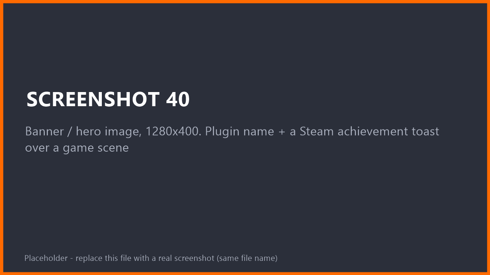
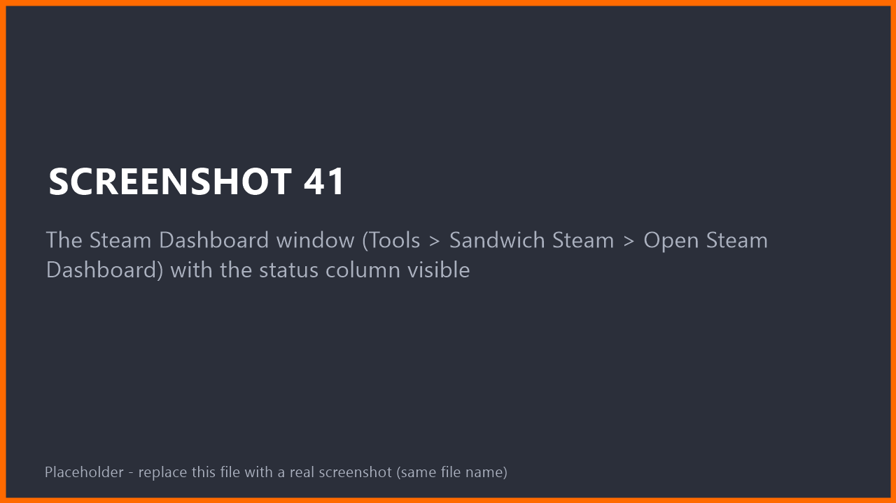
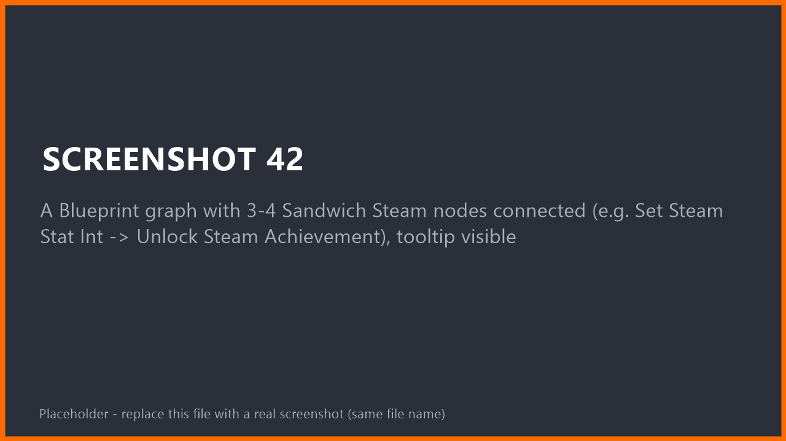

<!-- SHOT 40: Banner / hero image, 1280x400. Plugin name + a Steam achievement toast over a game scene -->

# Sandwich Steam

**Steam for Unreal Engine 5, made friendly.**
Achievements, stats, leaderboards, lobbies, voice chat, Steam Input, cloud saves and more.
Use it from **Blueprints** or **C++**. Set it up from an editor dashboard instead of hand-editing config files.

[**Documentation**](https://sandwichcakestudios.github.io/SandwichSteam/) ·
[Installation](https://sandwichcakestudios.github.io/SandwichSteam/installation.html) ·
[Quick Start](https://sandwichcakestudios.github.io/SandwichSteam/quick-start.html) ·
[Troubleshooting](https://sandwichcakestudios.github.io/SandwichSteam/troubleshooting.html)

---

## Why Sandwich Steam?

| | |
|---|---|
| **Blueprint first** | Every feature has Blueprint nodes with tooltips. No C++ needed to *use* the plugin. |
| **Setup dashboard** | One editor window shows what is missing (App ID, config, data asset) and fixes it with a button. |
| **No Steamworks SDK download** | It uses the Steamworks that ships with Unreal Engine. |
| **Pick only what you need** | Each feature is its own module. Delete the folder of a feature you do not use. |
| **Tags, not magic strings** | Achievements, stats and leaderboards are chosen from a Gameplay Tag dropdown. Raw Steam names work too. |
| **Built-in test panel** | Press one console command in a running game to see live Steam data and try every feature. |

<!-- SHOT 41: The Steam Dashboard window (Tools > Sandwich Steam > Steam Dashboard) with the status column visible -->

## What is inside

| Feature | What you can do |
|---|---|
| **User** | Steam name, Steam ID, avatars, level, ownership and Family Sharing |
| **Utility** | App ID, country, language, server time, Steam Deck / Big Picture detection |
| **Overlay** | Open any Steam overlay page, react to the overlay opening and closing |
| **Stats** | Read, set and add Steam stats. Uploads are batched for you |
| **Achievements** | Unlock, progress toasts, icons, global unlock percentages |
| **Leaderboards** | Upload scores, top N, around me, friends |
| **Friends** | Friend lists, groups, change events |
| **Rich Presence** | Show what the player is doing in the Steam friends list, with translations |
| **Cloud Saves** | Save slots with corruption check and conflict policy |
| **DLC** | Ownership, install, progress, open the store page |
| **Screenshots** | Steam screenshots, viewport capture, location and tagged users |
| **Sessions & Lobbies** | Create, find, join and invite, join from a Steam invite even on a cold start |
| **Voice Chat** | Push to talk or open mic, mute, Steam block list, "who is talking" events |
| **Steam Input** | Controllers as Enhanced Input keys, action sets, glyphs, haptics |
| **Publish Tool** | Download SteamCMD, package your game and upload a build from the editor |

<!-- SHOT 42: A Blueprint graph with 3-4 Sandwich Steam nodes connected (e.g. Set Steam Stat Int -> Unlock Steam Achievement), tooltip visible -->

## Quick start in 60 seconds

> Sandwich Steam is a **source plugin**: Unreal builds it on your machine the first time. The [installation guide](https://sandwichcakestudios.github.io/SandwichSteam/installation.html) walks you through it, including the one-time Visual Studio setup for Blueprint-only projects.

1. Download this repository (**Code > Download ZIP**) and copy the folder into `YourProject/Plugins/SandwichSteam`.
2. Open your project. When Unreal asks to rebuild the missing modules, click **Yes**.
3. Open **Tools > Sandwich Steam > Steam Dashboard** and follow the green checks.
4. Press **Play > Standalone Game** (Steam does not run in Play In Editor) and type `Steam.Test.Toggle` in the console.

Full walkthrough: **[Quick Start: your first achievement in 10 minutes](https://sandwichcakestudios.github.io/SandwichSteam/quick-start.html)**

## Requirements

- Unreal Engine **5.8**
- A C++ compiler for the one-time plugin build (Visual Studio with the *Game development with C++* workload on Windows)
- The **Steam client**, running and logged in, when you test
- Nothing to buy: you can develop against Valve's public test app **Spacewar (App ID 480)**

## Project status

Sandwich Steam is young. This table is honest about what has been tested.

| Area | Status |
|---|---|
| Windows (Win64) | Tested |
| macOS, Linux | **Experimental**: written for them, never run |
| User, Utility, Overlay, Stats, Achievements, Leaderboards | Tested in a Standalone game |
| Friends, Rich Presence, Cloud, Screenshots | Tested with one account (presence data checked on a second one) |
| Sessions & Lobbies | Create, host travel, join and SteamSockets travel tested on two machines. Invites, kick, owner migration and lobby chat **not yet tested** |
| Voice Chat | Starts and lists players. Audio, mute and blocked players **not yet tested** |
| Steam Input | Builds and unit tests pass. **Not yet tested with a real controller** |
| DLC | Works with the test app. **Not yet tested with a real DLC App ID** |
| Editor Dashboard, App Definition, SteamCMD download | Tested on Windows |
| Publish Tool (packaging, real upload, Cancel) | Tested on Windows with a real App ID |
| Dashboard Setup page, confirm window | Tested on Windows |

Found a problem? Please [open an issue](https://github.com/SandwichCakeStudios/SandwichSteam/issues/new/choose).

## Contributing

Bug reports, doc fixes and pull requests are welcome. See [CONTRIBUTING.md](CONTRIBUTING.md).

## License

[MIT](LICENSE) © 2026 Sandwich Cake Studios.

*Sandwich Steam is an independent project. It is not affiliated with or endorsed by Valve Corporation or Epic Games. Steam and the Steam logo are trademarks of Valve Corporation. Unreal Engine is a trademark of Epic Games, Inc.*
