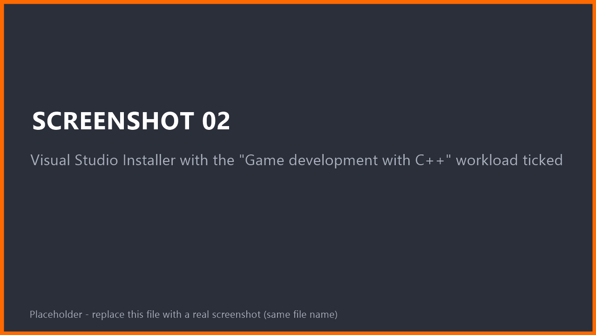
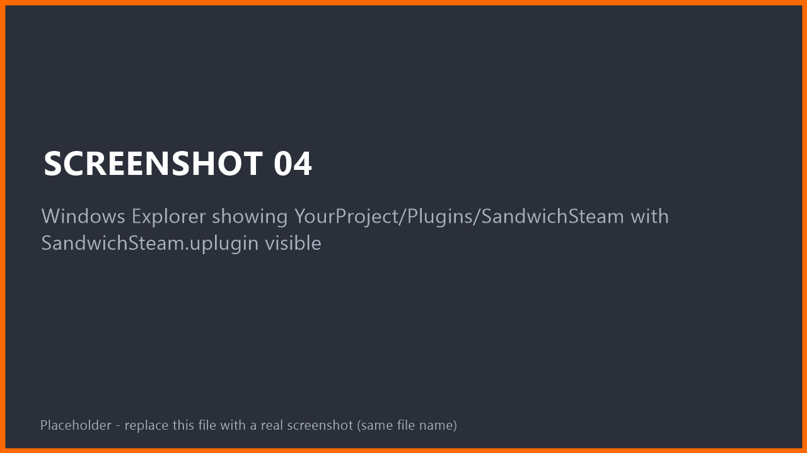
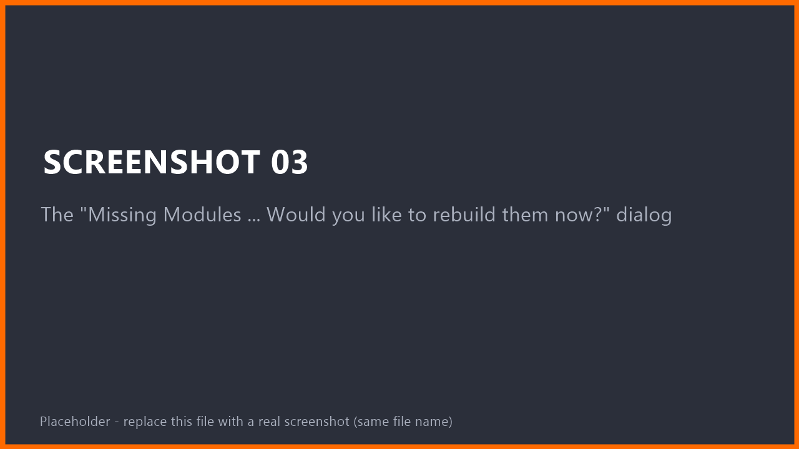
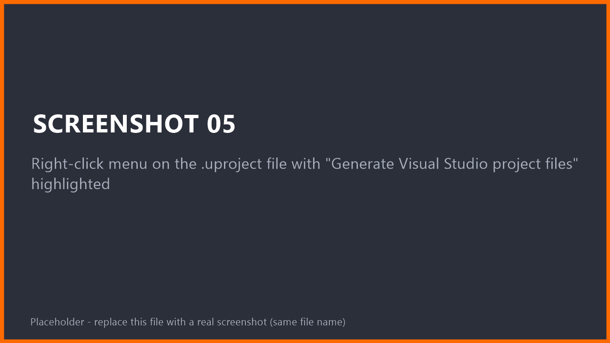
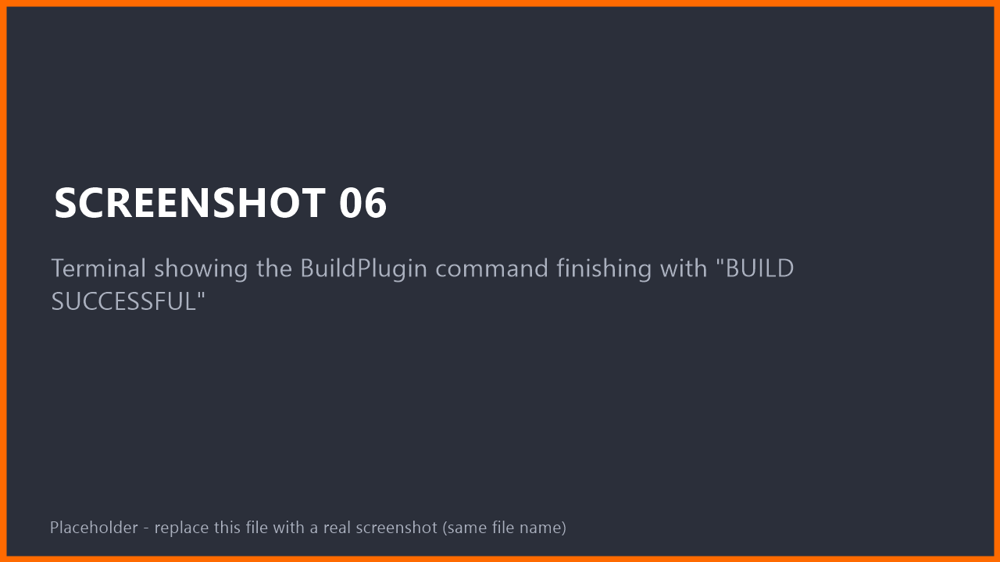
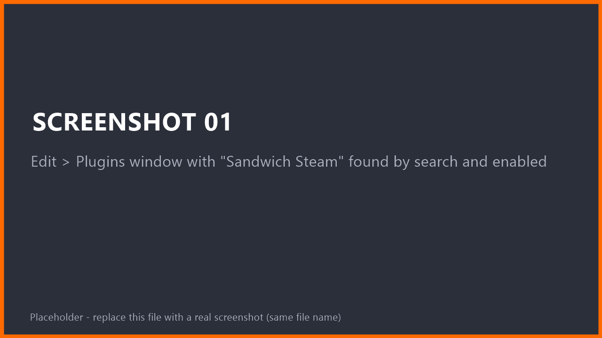

# Installation
{: .no_toc }

Sandwich Steam is a **source plugin**. That means Unreal has to *compile* it once on your computer. This sounds scary, but for most people it is: install a free tool, click "Yes" on a dialog, wait a few minutes.

1. TOC
{:toc}

---

## Which path is mine?

| My project is... | Use |
|---|---|
| **Blueprint only** (no `Source` folder, nothing to do with C++) | [Path 1](#path-1-blueprint-project) |
| **A C++ project** (has a `Source` folder and a `.sln` or Rider setup) | [Path 2](#path-2-c-project) |
| **I want one build I can reuse in many projects** | [Path 3](#path-3-build-the-plugin-once-and-reuse-it) |

You need **Unreal Engine 5.8**. Other versions are not supported.

---

## Step 0: install a compiler (Windows)

Skip this if you already build C++ projects.

1. Install **Visual Studio** (the free *Community* edition is fine). Use the Visual Studio version that Epic lists for UE 5.8 in their [setup guide](https://dev.epicgames.com/documentation/en-us/unreal-engine/setting-up-visual-studio-development-environment-for-cplusplus-projects-in-unreal-engine).
2. In the Visual Studio Installer, tick the workload **Game development with C++**.
3. In the right-hand *Installation details* list, also tick **Unreal Engine installer** and **Unreal Engine test adapter** if they are not already ticked.
4. Click **Install** and wait. It is a big download.

<!-- SHOT 02: Visual Studio Installer with the "Game development with C++" workload ticked -->


> **Why?** Unreal needs a compiler to turn the plugin's source code into something it can run. You will never open Visual Studio yourself in Path 1. Unreal uses it in the background.

> **macOS / Linux:** the plugin is written for them but has never been run there. You are welcome to try, and to tell us how it went in an [issue](https://github.com/SandwichCakeStudios/SandwichSteam/issues).

---

## Step 1: get the plugin

**Option A: download (easiest).**
1. Open the [repository page](https://github.com/SandwichCakeStudios/SandwichSteam).
2. Click the green **Code** button, then **Download ZIP**.
3. Unzip it. You will get a folder named `SandwichSteam-main`.

**Option B: git.**
```
git clone https://github.com/SandwichCakeStudios/SandwichSteam.git
```

## Step 2: put it in your project

1. Open your project folder (the one with the `.uproject` file).
2. If there is no `Plugins` folder, create one.
3. Copy the plugin folder in and **rename it to exactly `SandwichSteam`**. The file `SandwichSteam.uplugin` must sit directly inside it.

```
YourProject/
├─ YourProject.uproject
├─ Content/
└─ Plugins/
   └─ SandwichSteam/
      ├─ SandwichSteam.uplugin     <-- must be here
      ├─ Source/
      ├─ Config/
      └─ Resources/
```

<!-- SHOT 04: Windows Explorer showing YourProject/Plugins/SandwichSteam with SandwichSteam.uplugin visible -->


> **Common mistake:** a double folder like `Plugins/SandwichSteam-main/SandwichSteam/SandwichSteam.uplugin`. Unreal will not find the plugin. Move the inner folder up one level.

---

## Path 1: Blueprint project

You have done Steps 0 to 2. Now:

1. **Double-click your `.uproject`** to open the project.
2. Unreal shows a dialog: *"Missing Modules: The following modules are missing or built with a different engine version... Would you like to rebuild them now?"* Click **Yes**.

   <!-- SHOT 03: The "Missing Modules ... Would you like to rebuild them now?" dialog -->
   

3. Wait. The first build takes a few minutes. The editor opens when it is done.
4. Go to [Check that it worked](#check-that-it-worked).

> **The dialog says the build failed?** See [Troubleshooting](troubleshooting.html#the-plugin-fails-to-build). The most common cause is a missing Visual Studio workload (Step 0).

---

## Path 2: C++ project

1. Do Steps 1 and 2.
2. Right-click your `.uproject` and choose **Generate Visual Studio project files**.

   <!-- SHOT 05: Right-click menu on the .uproject file with "Generate Visual Studio project files" highlighted -->
   

3. Open the `.sln` and build your editor target (**Development Editor**, **Win64**) as usual. Rider users: open the `.uproject` and build from there.
4. To call the plugin from your own C++, add the modules you use to your `YourProject.Build.cs`:

```csharp
PublicDependencyModuleNames.AddRange(new string[]
{
    "SandwichSteam",              // core (always needed)
    "SandwichSteamStats",         // only add the ones you use:
    "SandwichSteamAchievements",
});
```

| Module | Feature |
|---|---|
| `SandwichSteam` | Core: User, Utility, Overlay, settings, App Definition |
| `SandwichSteamStats` | Stats |
| `SandwichSteamAchievements` | Achievements (needs `SandwichSteamStats`) |
| `SandwichSteamLeaderboards` | Leaderboards |
| `SandwichSteamFriends` | Friends |
| `SandwichSteamPresence` | Rich Presence |
| `SandwichSteamCloud` | Cloud saves |
| `SandwichSteamDLC` | DLC |
| `SandwichSteamScreenshots` | Screenshots |
| `SandwichSteamSessions` | Sessions and lobbies |
| `SandwichSteamVoice` | Voice chat |
| `SandwichSteamInput` | Steam Input |
| `SandwichSteamEditor` | Editor tools (editor only, you never reference it) |
| `SandwichSteamTest` | In-game test panel (development builds only) |

> **Don't need a feature?** Delete its folder under `Plugins/SandwichSteam/Source/` **and** its entry in `SandwichSteam.uplugin`, then regenerate project files. Nothing else depends on it, except that Achievements needs Stats.

---

## Path 3: build the plugin once and reuse it

Do this if you want the same compiled plugin in several projects, or you do not want each project to compile it. You still need the compiler from Step 0.

Open a terminal and run (adjust the paths to your install):

```
"C:\Program Files\Epic Games\UE_5.8\Engine\Build\BatchFiles\RunUAT.bat" BuildPlugin ^
  -Plugin="C:\Path\To\SandwichSteam\SandwichSteam.uplugin" ^
  -Package="C:\Builds\SandwichSteam" ^
  -TargetPlatforms=Win64
```

<!-- SHOT 06: Terminal showing the BuildPlugin command finishing with "BUILD SUCCESSFUL" -->


When it says **BUILD SUCCESSFUL**, copy `C:\Builds\SandwichSteam` into any project's `Plugins` folder (or into `UE_5.8\Engine\Plugins\Marketplace` to make it available to all projects). Those projects no longer need to compile it.

> The result only works with the engine version and platform you built it for.

---

## Check that it worked

1. Open the editor. Go to **Edit > Plugins**, search for **Sandwich Steam**. It should be ticked. If not, tick it and restart.

   <!-- SHOT 01: Edit > Plugins window with "Sandwich Steam" found by search and enabled -->
   

2. Look at the **Tools** menu. You should see **Sandwich Steam > Open Steam Dashboard**.

   <!-- SHOT 07: The Tools menu open, with the Sandwich Steam submenu and "Open Steam Dashboard" visible -->
   

3. Right-click in any Blueprint and search for `Steam`. You should see nodes such as **Unlock Steam Achievement**.

Installed. Next: **[Quick Start: your first achievement](quick-start.html)**.

## What gets enabled automatically

Sandwich Steam uses Unreal's own Steam support, so it switches on these engine plugins for you: **Online Subsystem**, **Online Subsystem Utils**, **Online Subsystem Steam** and **Steam Sockets**. You do **not** need to download the Steamworks SDK. **Enhanced Input** is used for push to talk and Steam Input if you have it enabled.

## Updating

Close the editor, replace the `Plugins/SandwichSteam` folder with the new version, delete the project's `Binaries` and `Intermediate` folders (they are rebuilt automatically) and reopen the project.
