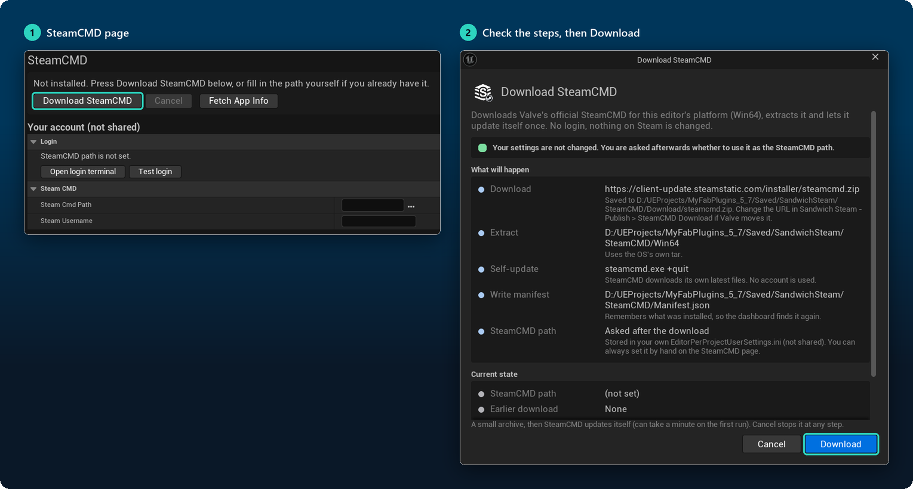
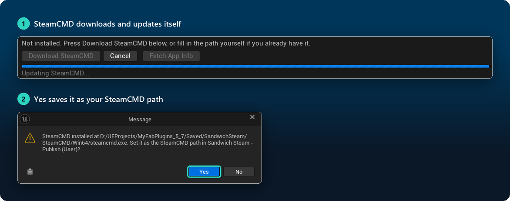
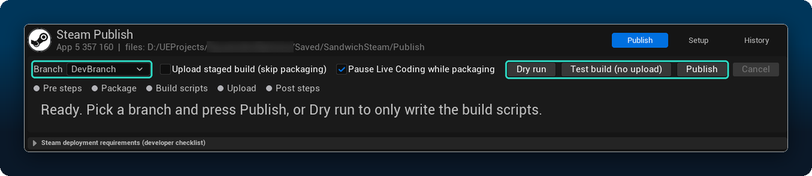
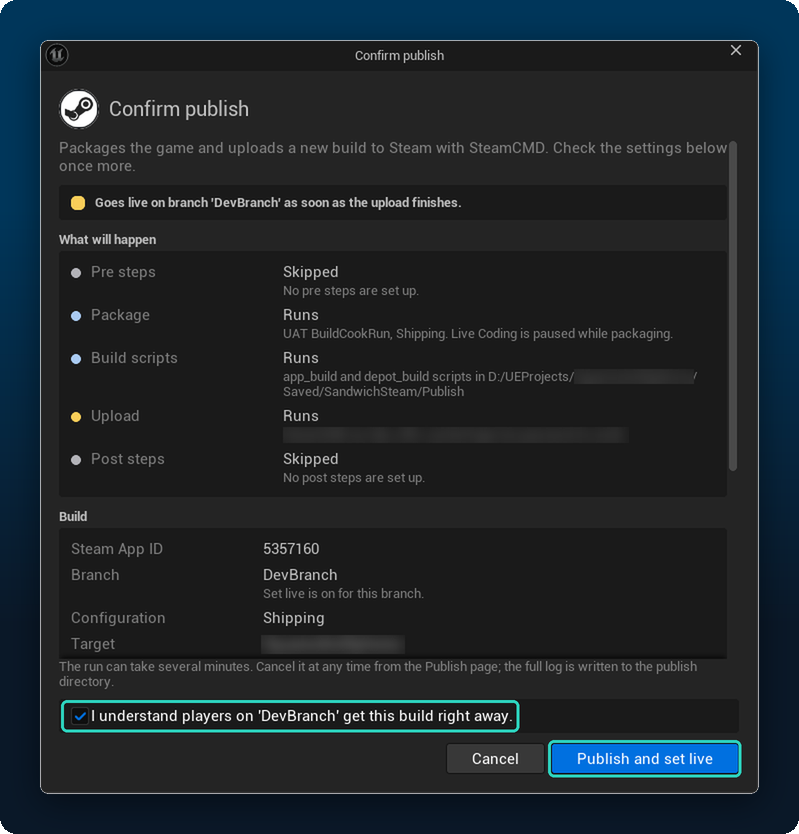
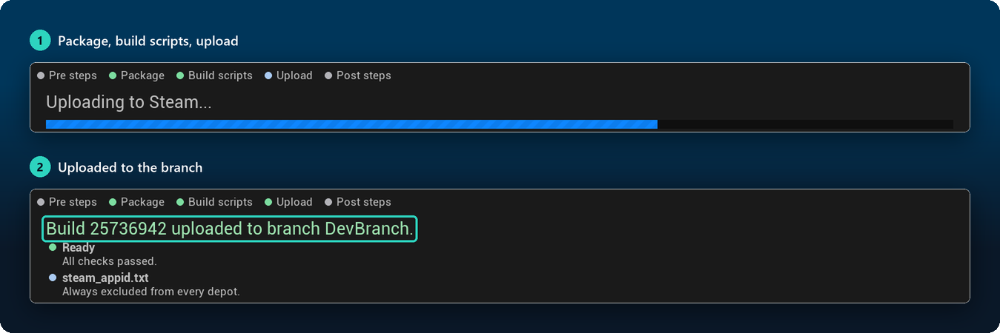

# Publishing to Steam
{: .no_toc }

The **Publish Tool** on the Steam Dashboard packages your game, writes Valve's build scripts and uploads the build with SteamCMD, without leaving the editor. It is an editor tool only; nothing of it ships with your game.

1. TOC
{:toc}

## Before you begin

- **Your own App ID and depots.** Create them on the [Steamworks partner site](https://partner.steamgames.com/). Spacewar (`480`) cannot be uploaded to.
- **The App ID is set** in **Project Settings > Plugins > Sandwich Steam** (see the [Quick Start](quick-start.html#set-the-app-id)).
- **A Steam account with upload rights** for that app. Valve recommends a separate build account.

> The screenshots on this page use the author's own App ID and a branch called `DevBranch`. Yours will show your own.

The dashboard's **Setup** page lists the publishing steps in order (SteamCMD, Steam account, Depots & branches) with one button each. The sections below explain them.

---

## 1. Install SteamCMD

SteamCMD is Valve's command line tool that uploads builds. The dashboard downloads it for you.

1. On the dashboard's **SteamCMD** page, click **Download SteamCMD**.
2. A window shows exactly what will happen: the download address, where it is extracted, and that your settings are not changed yet. Click **Download**.

<!-- SHOT 50: SteamCMD page with Download SteamCMD, then the Download SteamCMD dialog -->

3. SteamCMD downloads and updates itself once. This can take a minute the first time.
4. When asked whether to use it as your SteamCMD path, click **Yes**.

<!-- SHOT 51: SteamCMD downloading, then the question to save it as the SteamCMD path -->

> **Already have SteamCMD?** Fill in **Steam Cmd Path** on the SteamCMD page yourself. The path and your account name are saved only for you (`EditorPerProjectUserSettings.ini`), never in the shared project settings.

## 2. Log in once

1. On the SteamCMD page, fill in **Steam Username**.
2. Click **Open login terminal**. Type your password and Steam Guard code in the terminal, wait for `OK`, then type `quit`.
3. Click **Test login** to check it.

SteamCMD remembers the login. The plugin never sees, stores or sends your password. If Steam asks for a Steam Guard code during an upload, a dialog opens for it.

## 3. Depots and branches

On the **Publish** page, open the **Setup** tab. It holds the settings the whole team shares (saved in `DefaultEditor.ini`, so commit it):

- **Depots:** one per platform, with its Depot ID from the partner site, content folder and exclusions.
- **Branches:** the branch names you upload to, and whether a build goes live on them right away.
- **Build:** Development or Shipping, the build description, optional pre and post steps, and **Target Name** if your project has more than one game target.

**Fetch from Steam** on the dashboard's Setup page (or **Fetch App Info** on the SteamCMD page) reads your depots and branches from Steam and fills them in.

## 4. Publish

On the **Publish** page, pick a **Branch**, then choose what to run:

| Button | What it does |
|---|---|
| **Dry run** | Checks your setup and writes the build scripts. Nothing is packaged or uploaded |
| **Test build (no upload)** | Everything except the upload: packages the game and writes the scripts. Use it to check packaging first |
| **Publish** | Packages, writes the scripts and uploads to the branch |

Tick **Upload staged build (skip packaging)** to reuse the last packaged build instead of packaging again.

<!-- SHOT 52: Publish page: branch, Dry run, Test build and Publish -->

## 5. Confirm

Before anything runs, a window lists every step, the build settings and any warnings. If the branch goes live right away, tick **I understand...** to enable **Publish and set live**.

<!-- SHOT 53: The Confirm publish dialog listing every step before anything runs -->

## 6. Watch it run

The steps light up one after the other: *Pre steps*, *Package*, *Build scripts*, *Upload*, *Post steps*. The log streams live below them, and **Cancel** stops the run at any point. When it is done you get the BuildID and a notification.

<!-- SHOT 54: Publishing in progress (package, build scripts, upload), then the uploaded build -->

The **History** tab lists every run with its result and BuildID. `steam_appid.txt` is always left out of the upload.

---

## Where the files go

Everything the tool writes is in one folder, `Saved/SandwichSteam` by default (change it with **Data Directory** in **Project Settings > Plugins > Sandwich Steam**):

| Folder | Holds |
|---|---|
| `SteamCMD/` | The downloaded SteamCMD |
| `Publish/` | The build scripts, SteamCMD output, a log file per run and the history |
| `StagedBuilds/` | The packaged game that is uploaded |

## When it fails

- The run stops with the reason in the log. The same errors are listed in the **Message Log** (category *Sandwich Steam*), and the full output is in `Publish/Logs/`.
- **SteamCMD asks for a password:** the cached login has expired. Do [step 2](#log-in-once) again.
- **The uploaded Shipping build has no Steam** when you double-click its `.exe`: that is expected. Shipping builds get Steam only when started from Steam. See [Troubleshooting](troubleshooting.html#it-works-in-the-editor-but-not-in-my-packaged-game).
