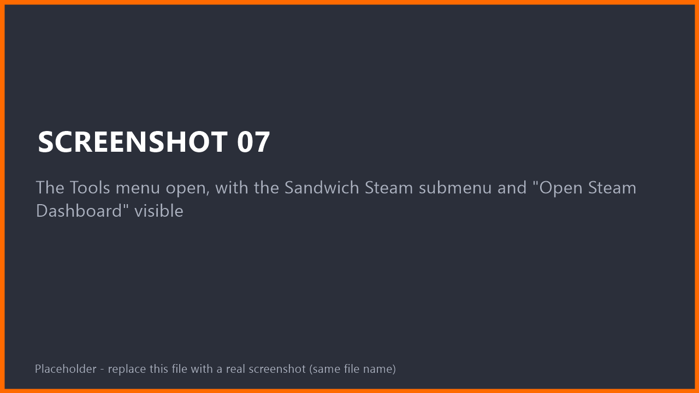
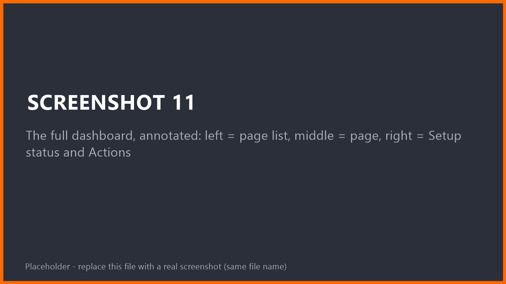
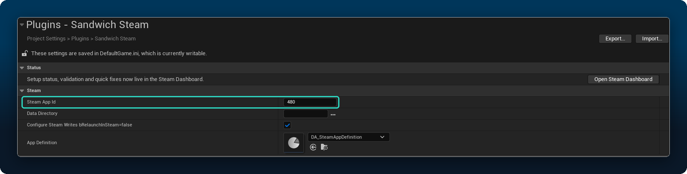
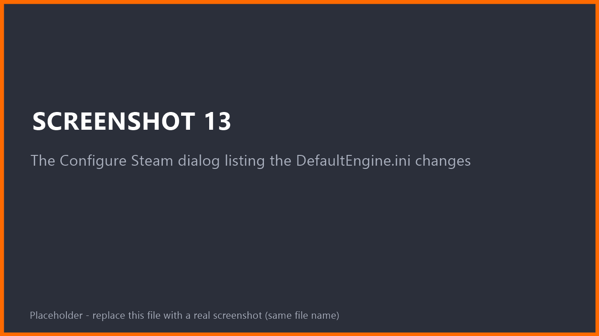
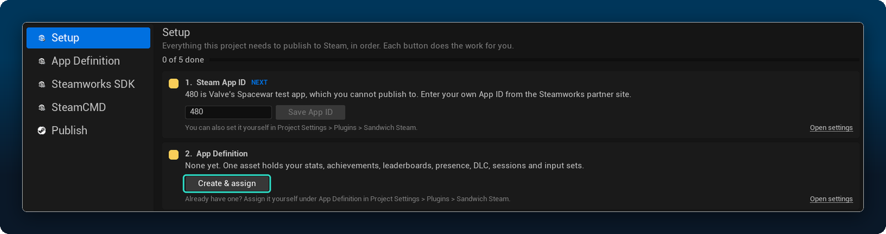
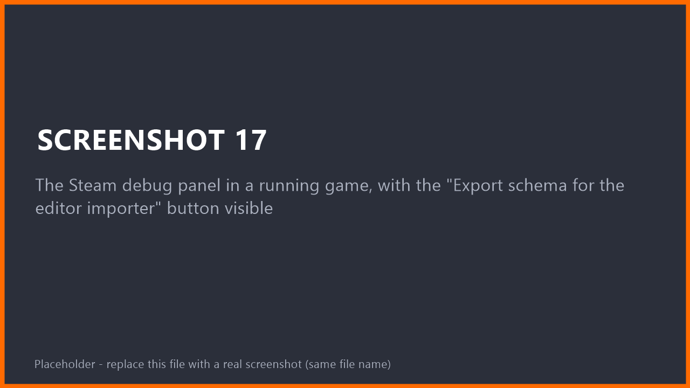
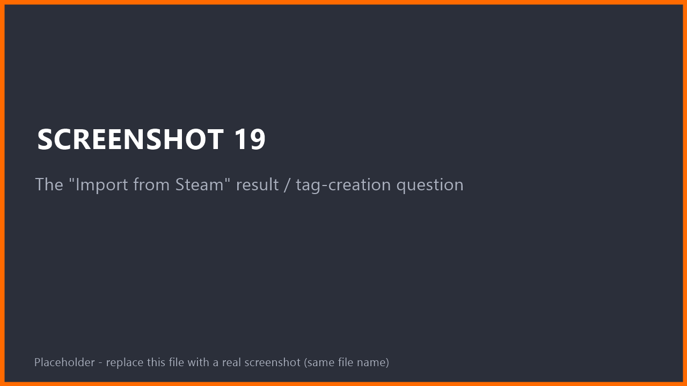
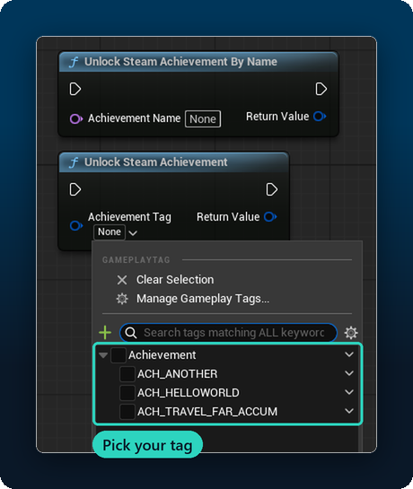
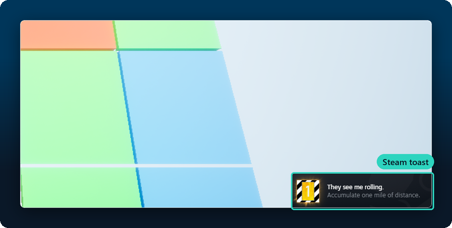

# Quick Start: your first achievement in 10 minutes
{: .no_toc }

By the end of this page you will have unlocked a real Steam achievement from a Blueprint, using Valve's free test app *Spacewar*, without buying anything.

1. TOC
{:toc}

## Before you begin

- [Sandwich Steam is installed](installation.html) and the editor is open.
- The **Steam client is running and you are logged in.**
- You will test with **Play > Standalone Game**. Steam does **not** work in Play In Editor; if you press the normal Play button, every Steam node will just report *Unavailable*.

> **What is Spacewar?** App ID `480` is a public Valve test game that any Steam account can run. It lets you try everything before you own a Steam page. When you have your own App ID, you swap the number and re-run the steps.

---

## 1. Open the Steam Dashboard

Open the **Tools** menu and click **Steam Dashboard** (in the *Sandwich Steam* section), or click the Steam button in the editor toolbar.

<!-- SHOT 07: The Tools menu open with Steam Dashboard in the Sandwich Steam section, and the Steam toolbar button -->

The dashboard has three parts: a page list on the left, the selected page in the middle, and on the right a **Setup status** card with a coloured dot per check, plus an **Actions** card. Red means "fix me". Hover a row to read the full explanation. Our goal is to get everything green.

<!-- SHOT 11: The full dashboard, annotated: left = page list, middle = page, right = Setup status and Actions -->

## 2. Set the App ID

1. In the dashboard's **Actions** card, click **Project Settings...**. It opens **Project Settings > Plugins > Sandwich Steam**.
2. Set **Steam App ID** to `480`.

<!-- SHOT 12: Project Settings > Plugins > Sandwich Steam with Steam App ID set to 480 -->

## 3. Let the plugin configure the project

Steam needs a few lines in your project's `DefaultEngine.ini`. You do not have to type them.

1. Back in the dashboard, click **Configure Steam...**.
2. A window lists **every change** before anything is written. Read it, then confirm.

<!-- SHOT 13: The Configure Steam dialog listing the DefaultEngine.ini changes -->

> You do not need to create `steam_appid.txt`. When you run Standalone or a Development build, Unreal writes it next to the running executable and deletes it when the game exits. If Steam still does not recognise your game, see the dashboard's **Advanced** page. The Publish Tool always leaves the file out.

> **Optional network tuning.** The dashboard's **Advanced** page can also write higher bandwidth caps and a connect timeout for SteamSockets sessions (off by default). It writes `MaxClientRate`, `MaxInternetClientRate`, `InitialConnectTimeout`, `ConfiguredInternetSpeed` and `ConfiguredLanSpeed` into `DefaultEngine.ini`, and `TotalNetBandwidth`, `MaxDynamicBandwidth` and `MinDynamicBandwidth` into `DefaultGame.ini`. The values are starting points; set them for your game.

## 4. Create your App Definition

The **Steam App Definition** is one small asset that lists your game's stats, achievements, leaderboards and so on. It is what makes the dropdowns in Blueprint nodes work.

1. In the dashboard, stay on the **Setup** page. It lists everything in order.
2. Under **2. App Definition**, click **Create & assign**. This creates `Content/Steam/DA_SteamAppDefinition` and assigns it in the settings for you. (The **Create and assign** button in the Setup status card does the same.)

<!-- SHOT 15: Dashboard Setup page, step 2 App Definition, with the "Create & assign" button -->

Click **Re-check**. The Setup status rows should now be green. Spacewar (480) shows an *info* row saying you use the test app. That is expected.

## 5. Import the achievements from Steam

Steam knows which achievements Spacewar has. You can pull them into your App Definition instead of typing them.

1. Press **Play > Standalone Game**.
2. In the running game, press the **~** key and enter `Steam.Debug.Show`. A debug panel appears.
3. Scroll down in the panel to the **Stats** section, click **Export schema for the editor importer**, then close the game.

<!-- SHOT 17: The Steam debug panel in a running game -->

> **Without the panel:** type `Steam.Stats.ExportSchema` in the console instead. It writes the same file.

4. In the editor's dashboard, on the **App Definition** page, click **Import from Steam...**.
5. When asked whether to create gameplay tags, click **Yes**. You get one tag per achievement, like `Steam.Achievement.<Name>`.

<!-- SHOT 19: Dashboard App Definition page with "Import from Steam...", then the tag-creation question -->

6. **Save** the App Definition asset.

> **Nothing to import?** Make sure you ran the export from a *Standalone* game with Steam running, and that the App ID was `480` at that time.

## 6. Unlock it from a Blueprint

1. Open your level's **Level Blueprint** (or any Blueprint that runs in the game).
2. Right-click on the graph and search for **Unlock Steam Achievement**.
3. Connect it where the achievement should unlock. For this test, **Event BeginPlay** is fine.
4. Click the achievement dropdown and pick one of the tags you just created.

<!-- SHOT 20: Blueprint graph: Unlock Steam Achievement with its achievement tag dropdown open -->

5. **Compile** and **Save**.

## 7. Run it

1. Press **Play > Standalone Game**.
2. Watch the bottom-right corner of your screen. Steam shows its achievement pop-up.

<!-- SHOT 21: The Steam achievement toast in the corner of the running game -->

**No pop-up?** Open the console (**~**) and type `Steam.Achievements.Dump`. It prints every achievement and whether it is unlocked.

**Want to test it again?** An unlocked achievement stays unlocked. In a development game, type `Steam.Achievements.Clear <ApiName>` to lock it again.

---

## You did it! What next?

- **Try every feature without writing anything:** in a Standalone game type `Steam.Test.Toggle`. The test panel has one page per feature with buttons and live values.

<!-- SHOT 43: The in-game test panel (Steam.Test.Toggle), Stats page -->

- **Something went wrong?** [Troubleshooting](troubleshooting.html).
- **Feature guides** for stats, leaderboards, sessions, voice and more are coming.
- **Ready for your own game?** Get an App ID in the [Steamworks partner site](https://partner.steamgames.com/), put it in the settings instead of `480`, and repeat steps 3 to 5.
- **Ready to upload a build?** [Publishing to Steam](publishing.html) packages and uploads from the dashboard.

## Useful console commands

Run them in a Standalone or development game (open the console with **~**).

| Command | What it does |
|---|---|
| `Steam.Debug.Show` | Live debug panel with buttons for every installed feature |
| `Steam.Test.Toggle` | The test panel |
| `Steam.Core.Dump` | Overall Steam state. **Include this in bug reports** |
| `Steam.Stats.Dump` | Stats state and values |
| `Steam.Achievements.Dump` | Every achievement and whether it is unlocked |
| `Steam.Achievements.Unlock <ApiName>` | Unlock one from the console |
