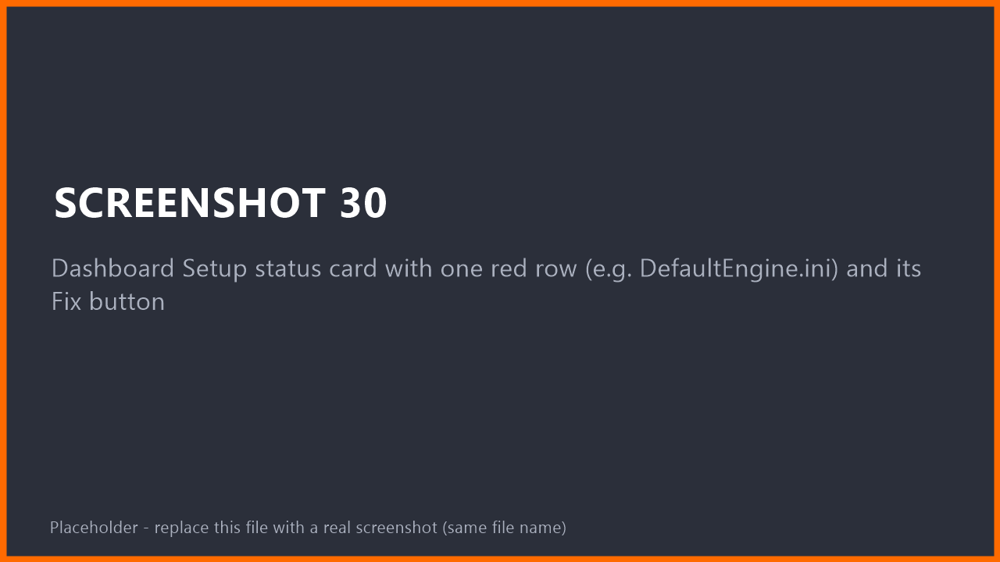
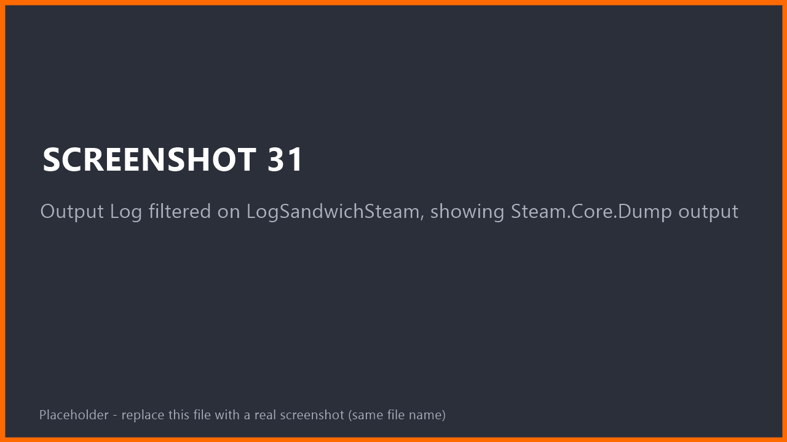

# Troubleshooting & FAQ
{: .no_toc }

1. TOC
{:toc}

## First, three quick checks

Most problems are one of these:

1. **Is the Steam client running and logged in?** It must be, every time you test.
2. **Are you using Play > Standalone Game?** Steam does not run in Play In Editor. Nodes report *Unavailable* there. This is normal.
3. **Is the Dashboard green?** Open **Tools > Sandwich Steam > Steam Dashboard**, click **Re-check** and look at the Setup status card.

<!-- SHOT 30: Dashboard Setup status card with one red row (e.g. DefaultEngine.ini) and its Fix button -->

## The Setup status card

| Row | What it means | What to do |
|---|---|---|
| Online Subsystem Steam plugin | The engine's Steam plugin is missing or disabled | Enable **Online Subsystem Steam** in **Edit > Plugins**, restart |
| Steamworks SDK | The plugin was built without Steamworks (unsupported platform or build) | Use Windows, or see [the plugin fails to build](#the-plugin-fails-to-build) |
| Steam App ID | It is `0` (error) or `480` (info: you are using the test app) | Set it in **Project Settings > Plugins > Sandwich Steam** |
| DefaultEngine.ini | Steam lines are missing or wrong | Click **Fix** / **Configure Steam...** |
| Steam App Definition | None assigned, cannot load, has invalid data, or is not in the cook | Click **Create and assign** / **Add to cook**. Hover the row for the exact problem |

**Show in Message Log** in the Actions card lists the same checks with details.

## The plugin fails to build

- **"Missing Modules" dialog, then an error about a compiler or Windows SDK.** Install the Visual Studio workload from [Installation, Step 0](installation.html#step-0-install-a-compiler-windows), then reopen the project.
- **The plugin is not found at all.** Check the folder layout: `Plugins/SandwichSteam/SandwichSteam.uplugin`. A folder inside a folder is the usual reason.
- **The plugin was built for a different engine version.** Delete the plugin's `Binaries` and `Intermediate` folders and your project's, then reopen. Sandwich Steam supports **UE 5.6, 5.7 and 5.8**.
- **Still failing?** Open an [issue](https://github.com/SandwichCakeStudios/SandwichSteam/issues/new/choose) and paste the first error line from the build log (in Unreal: **Tools > Output Log**, or the Visual Studio *Output* window).

## Steam does nothing / every node says "Unavailable"

| Situation | Why | Fix |
|---|---|---|
| You pressed the normal **Play** button | Steam does not run in Play In Editor | Use **Play > Standalone Game** |
| Steam client is closed | The plugin needs the running client | Start Steam and log in |
| Steam **closes while the game runs** | Unreal's Steam integration ends the game when Steam quits | Keep Steam running |
| `steam_appid.txt` missing | Steam cannot tell which game this is | Dashboard > **Create steam_appid.txt** |
| Project not configured | `DefaultEngine.ini` lacks the Steam lines | Dashboard > **Configure Steam...** |

Run `Steam.Core.Dump` in the game console. It tells you which of these is the reason.

## Achievements or stats do not save

- Run `Steam.Stats.Dump`. It must say the stats are **ready**. Writes made before that are queued and applied automatically.
- Stat uploads are **batched**: after a change, the plugin waits a few seconds (default 5) before sending. Unlocking an achievement sends immediately.
- Make sure the name or tag exists on Steam for **your App ID**. A wrong name fails with `Steam.Error.InvalidArgument` or `Steam.Error.Failed` and logs one warning.
- Do not use Unreal's own Online Subsystem achievement nodes for the same achievements at the same time.

## It works in the editor but not in my packaged game

- Package as **Development** first. Then run `Steam.Stats.Dump`. If it says the App Definition was not found, open the dashboard and click **Add to cook** on the Steam App Definition row.
- Put `steam_appid.txt` next to the packaged `.exe` **for testing only**, and remove it before releasing on Steam.

## The Steam overlay does not show

- Start the game as **Standalone Game** (not PIE) or as a packaged build.
- In Steam: **Settings > In Game > Enable the Steam Overlay while in-game** must be on.
- Some drivers and screen recorders conflict with the overlay. Close them to test.

## Sessions: searching finds nothing

On the shared test app **Spacewar (480)**, Steam returns other developers' lobbies and the plugin correctly rejects them, so the list is empty. Test with two accounts on your own App ID, or narrow the search with a *Profile Tag*.

## Steam.Error.* codes

Failed calls return a result with one of these tags:

| Tag | Meaning |
|---|---|
| `Steam.Error.Unavailable` | Steam is not running, or not available in this mode (for example PIE) |
| `Steam.Error.NotInitialized` | Steam is running but not ready yet, for example stats still loading |
| `Steam.Error.NotLoggedIn` | Steam client is not logged in |
| `Steam.Error.FeatureDisabled` | The feature is switched off in **Project Settings > Plugins > Sandwich Steam** |
| `Steam.Error.NotSupported` | Not possible on this platform or setup |
| `Steam.Error.InvalidArgument` | Bad name, tag or value (unknown achievement, wrong stat type...) |
| `Steam.Error.Timeout` | Steam did not answer in time |
| `Steam.Error.Failed` | Steam refused the request. Check the Output Log |
| `Steam.Error.Cancelled` | The request was cancelled |
| `Steam.Error.RateLimited` | Too many requests. Slow down |
| `Steam.Error.Offline` | Steam is in offline mode |
| `Steam.Error.QuotaExceeded` | For example Steam Cloud is full |
| `Steam.Error.NotOwner` | Only the host / owner may do this |
| `Steam.Error.WrongScope` | Client-only feature used on a server, or the other way round |

## Asking for help

Open an [issue](https://github.com/SandwichCakeStudios/SandwichSteam/issues/new/choose) and include:

1. Unreal Engine version and operating system
2. Output of `Steam.Core.Dump` from a **Standalone** game
3. Output Log lines from the `LogSandwichSteam` category (turn on **Verbose Logging** in **Project Settings > Plugins > Sandwich Steam** for more detail)

<!-- SHOT 31: Output Log filtered on LogSandwichSteam, showing Steam.Core.Dump output -->

